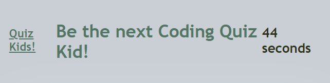

# Code-Quiz-Kid

## Table of Contents
- [Description](#description)
- [A Glimpse](#aglimpse)
- [Entry](#entry)

## Description
Here is a quiz meant to challenge a newer student of JavaScript and perhaps provide a bit of a chuckle at some of the off answers! This quiz will test you with four choices per question and reduce your time to complete if you guess incorrectly. When you complete or the time runs out you will be scored and be able to post your Initials on a board. Show your mom!

# A Glimpse

## Entry

[No Ticket Needed!]()